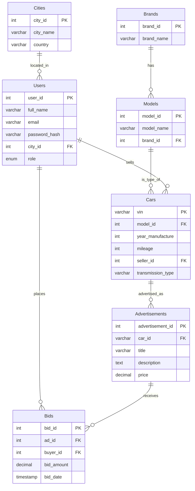

# 🚗 Car Marketplace Database

<div align="center">


*A comprehensive database system for managing an online car trading platform*

</div>

---

## 📋 Table of Contents

- [Overview](#-overview)
- [Database Schema](#-database-schema)
- [Entity Relationship Diagram](#-entity-relationship-diagram)
- [Sample Data](#-sample-data)
- [Getting Started](#-getting-started)
- [Sample Queries](#-sample-queries)
- [Authors](#-authors)

---

## 🎯 Overview

The **Car Marketplace Database** is a relational database system designed to simulate a real-world online car trading platform. It enables:

- 🏢 **Sellers** to list their vehicles for sale
- 🛒 **Buyers** to browse and bid on available cars
- 📊 **Administrators** to manage the marketplace efficiently

### Key Features

✅ Multi-city support across East Africa  
✅ Support for multiple car brands and models  
✅ User role management (Buyers & Sellers)  
✅ Advertisement management system  
✅ Real-time bidding functionality  
✅ Complete transaction history tracking

---

## 🗄️ Database Schema

### Tables Overview

| Table | Description | Primary Key |
|-------|-------------|-------------|
| 🏙️ **Cities** | Geographic locations | `city_id` |
| 🚙 **Brands** | Car manufacturers | `brand_id` |
| 🔧 **Models** | Car models by brand | `model_id` |
| 👤 **Users** | Platform users (buyers/sellers) | `user_id` |
| 🚗 **Cars** | Vehicle inventory | `vin` |
| 📢 **Advertisements** | Car listings | `advertisement_id` |
| 💰 **Bids** | Buyer offers on cars | `bid_id` |

### Detailed Table Structures

<details>
<summary><b>🏙️ Cities</b></summary>

| Column | Type | Description |
|--------|------|-------------|
| `city_id` | INT (PK) | Unique city identifier |
| `city_name` | VARCHAR | Name of the city |
| `country` | VARCHAR | Country name |

</details>

<details>
<summary><b>🚙 Brands</b></summary>

| Column | Type | Description |
|--------|------|-------------|
| `brand_id` | INT (PK) | Unique brand identifier |
| `brand_name` | VARCHAR | Manufacturer name |

</details>

<details>
<summary><b>🔧 Models</b></summary>

| Column | Type | Description |
|--------|------|-------------|
| `model_id` | INT (PK) | Unique model identifier |
| `model_name` | VARCHAR | Model name |
| `brand_id` | INT (FK) | References `Brands.brand_id` |

</details>

<details>
<summary><b>👤 Users</b></summary>

| Column | Type | Description |
|--------|------|-------------|
| `user_id` | INT (PK) | Unique user identifier |
| `full_name` | VARCHAR | User's full name |
| `email` | VARCHAR | User's email address |
| `password_hash` | VARCHAR | Encrypted password |
| `city_id` | INT (FK) | References `Cities.city_id` |
| `role` | ENUM | User role: `buyer` or `seller` |

</details>

<details>
<summary><b>🚗 Cars</b></summary>

| Column | Type | Description |
|--------|------|-------------|
| `vin` | VARCHAR (PK) | Vehicle Identification Number |
| `model_id` | INT (FK) | References `Models.model_id` |
| `year_manufacture` | INT | Manufacturing year |
| `mileage` | INT | Total kilometers driven |
| `seller_id` | INT (FK) | References `Users.user_id` |
| `transmission_type` | VARCHAR | Automatic or Manual |

</details>

<details>
<summary><b>📢 Advertisements</b></summary>

| Column | Type | Description |
|--------|------|-------------|
| `advertisement_id` | INT (PK) | Unique ad identifier |
| `car_id` | VARCHAR (FK) | References `Cars.vin` |
| `title` | VARCHAR | Advertisement title |
| `description` | TEXT | Detailed description |
| `price` | DECIMAL | Asking price in KSh |

</details>

<details>
<summary><b>💰 Bids</b></summary>

| Column | Type | Description |
|--------|------|-------------|
| `bid_id` | INT (PK) | Unique bid identifier |
| `ad_id` | INT (FK) | References `Advertisements.advertisement_id` |
| `buyer_id` | INT (FK) | References `Users.user_id` |
| `bid_amount` | DECIMAL | Bid amount in KSh |
| `bid_date` | TIMESTAMP | When the bid was placed |

</details>

---

## 📊 Entity Relationship Diagram



---

## 📦 Sample Data

### 🌍 Geographic Coverage

**Cities** across East Africa:
- 🇰🇪 **Kenya**: Nairobi, Mombasa, Kisumu
- 🇺🇬 **Uganda**: Kampala, Entebbe, Jinja
- 🇹🇿 **Tanzania**: Dar es Salaam, Zanzibar City, Arusha
- 🇷🇼 **Rwanda**: Kigali
- 🇧🇮 **Burundi**: Bujumbura
- 🇪🇹 **Ethiopia**: Addis Ababa
- 🇸🇸 **South Sudan**: Juba

### 🚙 Available Brands & Models

| Brand | Models |
|-------|--------|
| **Toyota** | Hilux, Corolla |
| **Ford** | Explorer |
| **Subaru** | Forester |

### 👥 Platform Users

| Name | Role | Location |
|------|------|----------|
| **Kimani Roy** | Seller | Nairobi 🏙️ |
| **Daudi Makumbi** | Buyer | Nairobi 🏙️ |
| **Hussein Ahmed** | Buyer | Nairobi 🏙️ |

### 🚗 Current Inventory

| Vehicle | Year | Transmission | Mileage | Seller | Price (KSh) |
|---------|------|--------------|---------|--------|-------------|
| Toyota Hilux | 2020 | Automatic | 45,000 km | Kimani | 3,500,000 |
| Subaru Forester | 2019 | Manual | 70,000 km | Kimani | 2,800,000 |

### 💰 Active Bids

| Bidder | Vehicle | Bid Amount (KSh) | Status |
|--------|---------|------------------|--------|
| Daudi Makumbi | Toyota Hilux 2020 | 3,600,000 | 🟢 Active |
| Hussein Ahmed | Toyota Hilux 2020 | 3,700,000 | 🟢 Active |
| Daudi Makumbi | Subaru Forester 2019 | 2,800,000 | 🟢 Active |
| Hussein Ahmed | Subaru Forester 2019 | 2,900,000 | 🟢 Active |

---

## 🚀 Getting Started

### Prerequisites

- MySQL Server 5.7 or higher
- MySQL Client or GUI tool (MySQL Workbench, phpMyAdmin, etc.)

### Installation

1️⃣ **Clone the repository**
```bash
git clone https://github.com/DaudiKi/Used_Car_Marketplace.git
cd Used_Car_Marketplace
```

2️⃣ **Import the database**
```bash
mysql -u your_username -p < used_car_marketplace.sql
```

3️⃣ **Verify the import**
```bash
mysql -u your_username -p
USE car_marketplace;
SHOW TABLES;
```

### Usage Workflow

```
1. 👤 Register Users → Buyers and Sellers create accounts
                ↓
2. 🚗 Add Cars → Sellers add vehicles to inventory
                ↓
3. 📢 Create Ads → Sellers publish advertisements with prices
                ↓
4. 💰 Place Bids → Buyers submit offers on listings
                ↓
5. 📊 Review → View all bids and manage transactions
```

---

## 🔍 Sample Queries

### View All Active Bids

```sql
SELECT 
    u.full_name AS bidder,
    a.title AS car,
    b.bid_amount,
    b.bid_date
FROM Bids b
JOIN Users u ON b.buyer_id = u.user_id
JOIN Advertisements a ON b.ad_id = a.advertisement_id
ORDER BY b.bid_date DESC;
```

### Find Highest Bid Per Advertisement

```sql
SELECT 
    a.title AS car,
    MAX(b.bid_amount) AS highest_bid,
    COUNT(b.bid_id) AS total_bids
FROM Advertisements a
LEFT JOIN Bids b ON a.advertisement_id = b.ad_id
GROUP BY a.advertisement_id, a.title;
```

### List All Cars by Brand

```sql
SELECT 
    br.brand_name,
    m.model_name,
    c.year_manufacture,
    c.mileage,
    c.transmission_type
FROM Cars c
JOIN Models m ON c.model_id = m.model_id
JOIN Brands br ON m.brand_id = br.brand_id
ORDER BY br.brand_name, m.model_name;
```

---

## 👨‍💻 Authors

<table>
  <tr>
    <td align="center">
      <b>Daudi Kirabo Makumbi Mawejje</b><br>
      Student ID: 189657
    </td>
    <td align="center">
      <b>Kimani Roy Macharia</b><br>
      Student ID: 191523
    </td>
    <td align="center">
      <b>Ahmed Hussein</b><br>
      Student ID: 193285
    </td>
  </tr>
</table>

---

<div align="center">

### 📄 License

This project is licensed under the MIT License.

### ⭐ Star this repository if you found it helpful!

Made with ❤️ for Database Management Systems

</div>
