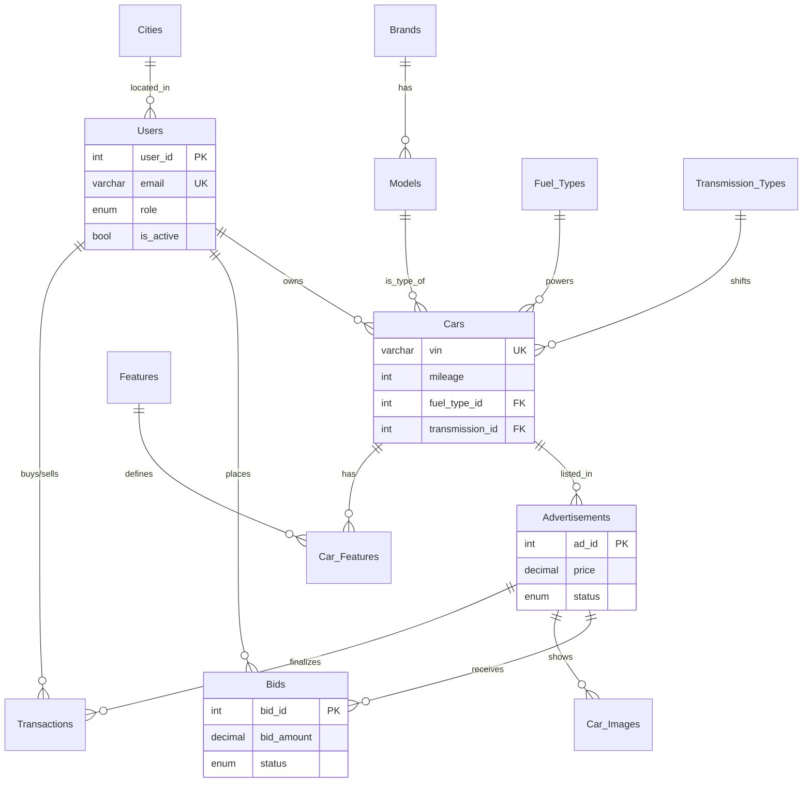

# 🚗 Car Marketplace Database

<div align="center">


*A production-ready database system for managing a comprehensive car trading platform*

</div>

---

## 📋 Table of Contents

- [Overview](#-overview)
- [Database Schema](#-database-schema)
- [Entity Relationship Diagram](#-entity-relationship-diagram)
- [Key Improvements & Best Practices](#-key-improvements--best-practices)
- [Getting Started](#-getting-started)
- [Sample Queries](#-sample-queries)
- [Authors](#-authors)

---

## 🎯 Overview

The **Car Marketplace Database** is a normalized relational database system designed for a modern online car trading platform. It supports:

- 🏢 **Sellers**: List vehicles with detailed features and multiple images.
- 🛒 **Buyers**: Browse listings, place bids, and track transaction history.
- 📊 **Administrators**: Manage users, roles, and marketplace integrity.

### Key Features

✅ **Multi-city support** across East Africa.  
✅ **Normalization**: Separate tables for fuel and transmission types for scalability.  
✅ **Feature Management**: M:N relationship for vehicle features (Sunroof, GPS, etc).  
✅ **Multi-image support**: Multiple photos per advertisement.  
✅ **Bid Lifecycle**: Track bid status (Pending, Accepted, Outbid).  
✅ **Transaction Tracking**: Secure logging of completed sales and payments.

---

## 🗄️ Database Schema

### Tables Overview

| Table | Description |
|-------|-------------|
| 🏙️ **Cities** | Geographic locations across East Africa |
| 🚙 **Brands** | Car manufacturers |
| 🔧 **Models** | Model names linked to brands |
| 👤 **Users** | Platform users with role-based access |
| ⛽ **Fuel_Types** | Petrol, Diesel, Electric, Hybrid, etc. |
| ⚙️ **Transmission_Types** | Manual, Automatic, CVT, etc. |
| 🚗 **Cars** | Core vehicle details (VIN, mileage, engine) |
| ✨ **Features** | Available vehicle options (e.g., Sunroof) |
| 📢 **Advertisements** | Public car listings with pricing |
| 📸 **Car_Images** | Image gallery for advertisements |
| 💰 **Bids** | Negotiation history between buyers/sellers |
| 📜 **Transactions** | Finalized sale records |

---

## 📊 Entity Relationship Diagram



---

## 🛠️ Key Improvements & Best Practices

1. **Normalization**: Moved `fuel_type` and `transmission_type` to separate tables to prevent data redundancy and allow easy addition of new types (like 'Hydrogen' or 'Semi-Auto').
2. **Indexing**: Added crucial indexes on `price`, `mileage`, and `status` to ensure fast search results as the database grows.
3. **Data Integrity**: 
   - Used explicit naming for constraints (e.g., `fk_cars_models`).
   - Implemented `ON DELETE CASCADE` for dependent records like images and car features.
4. **Security**: Added `password_hash` for users (mimicking hashed storage) and `is_active` for account management.
5. **Bid Status**: Introduced `bid_status` to track the lifecycle of an offer (Pending → Accepted/Rejected).

---

## 🚀 Getting Started

### Prerequisites

- MySQL Server 5.7+ or MariaDB 10.4+
- MySQL Client / Workbench

### Installation

1️⃣ **Clone the repository**
```bash
git clone https://github.com/DaudiKi/Used_Car_Marketplace.git
cd Used_Car_Marketplace
```

2️⃣ **Import the schema and data**
```bash
mysql -u your_username -p < structure.sql
mysql -u your_username -p < data.sql
```

---

## 🔍 Sample Queries

### Find Highest Accepted Bid per Ad
```sql
SELECT 
    a.title, 
    MAX(b.bid_amount) as final_price
FROM Advertisements a
JOIN Bids b ON a.ad_id = b.ad_id
WHERE b.bid_status = 'Accepted'
GROUP BY a.ad_id;
```

### Search Cars with Specific Features (e.g., Sunroof)
```sql
SELECT c.vin, m.model_name, f.feature_name
FROM Cars c
JOIN Models m ON c.model_id = m.model_id
JOIN car_features cf ON c.car_id = cf.car_id
JOIN features f ON cf.feature_id = f.feature_id
WHERE f.feature_name = 'Sunroof';
```

---

## 👨‍💻 Authors

| Name | Role | Student ID |
|------|------|------------|
| **Daudi Kirabo Makumbi Mawejje** | Backend & DB Design | 189657 |
| **Kimani Roy Macharia** | UI/UX & Documentation | 191523 |
| **Ahmed Hussein** | Quality Assurance | 193285 |
| **Aditya More** | Contributor | - |

---

<div align="center">

### 📄 License

This project is licensed under the MIT License.

Made with ❤️ for Database Management Systems

</div>

